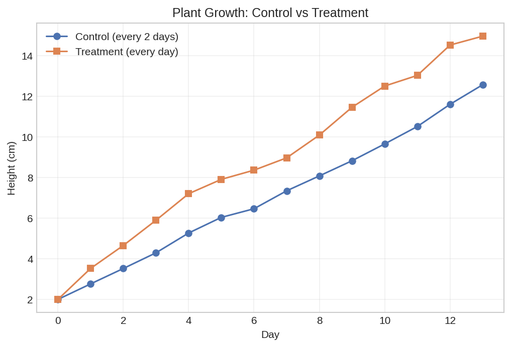

# Controlled Experiment Demo

A minimal, reproducible, and verifiable controlled experiment template.

This project demonstrates the core principles of scientific controlled experiments through a simple plant growth simulation. Everything runs on pure Python with zero external dependencies.

## Quick Start

```bash
# Run the experiment simulation
python3 simulate_experiment.py

# View the results
python3 plot_results.py results.csv

# Verify expected outcomes
python3 verify_results.py

# Analyze differences with statistical tests
python3 analyze.py results.csv
```

## Default Results (seed=42, 14 days)

| Metric | Control (2-day) | Treatment (daily) | Difference |
|--------|----------------|-------------------|------------|
| Final height | 12.57 cm | 14.96 cm | +2.39 cm (+19%) |



## Project Files

| File | Purpose |
|------|---------|
| simulate_experiment.py | Run the controlled experiment simulation |
| experiment.py | Real data recording and analysis tool |
| plot_results.py | Visualize results as chart or table |
| verify_results.py | Assert results match expected values and generate standardized group comparison |
| analyze.py | Full diagnostic report: group statistics, Welch t-test, Mann-Whitney U, Cohen's d effect size, data quality checks, divergence classification |
| analyze_extras.py | Statistical significance, three-source error attribution (baseline bias / within-group noise / trend separation), and IQR+z-score outlier detection |
| LICENSE | MIT License |

## Design Principles

1. **Zero dependencies** - Pure Python standard library only
2. **Reproducible** - Fixed random seed guarantees identical results
3. **Verifiable** - Built-in assertions confirm expected outcomes
4. **Minimal** - Each file does one thing clearly

## Why This Matters

Controlled experiments are the foundation of scientific reasoning. This template helps you learn experimental design through runnable code, quickly prototype hypotheses, and generate reproducible data for teaching or demos.

## License

MIT - see [LICENSE](LICENSE).

---

Also available in [中文](README.zh.md).
